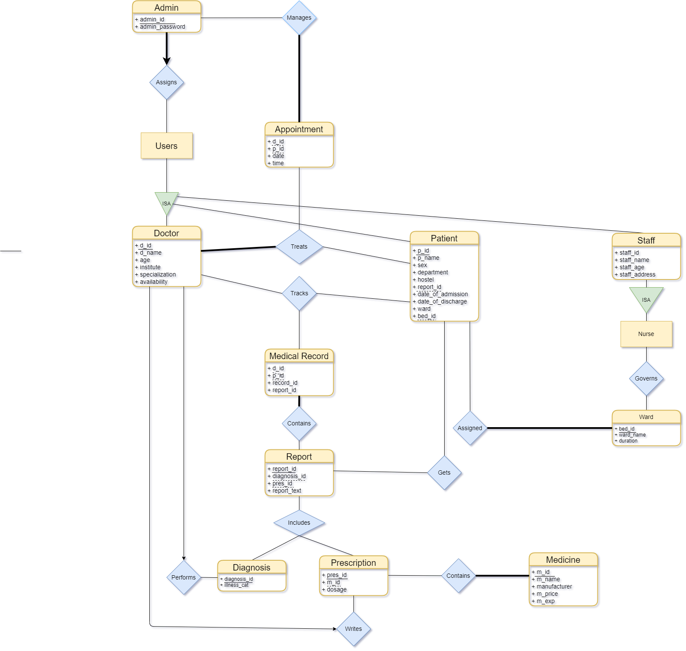

# Hospital Management System

DBMS Project under guidance of *Prof. Ashok Singh Sairam, Department of Mathematics, IIT Guwahati*

### Problem Recognition:
    Healthcare is the most critical aspect of our society, and many health care providers face challenges to offer practical and active services to patients. Considering a multispeciality health care centre, many people enter and exit the centre in a day and maintaining their records safely is tedious. To reduce this type of burdens and to manage the financial, administration and clinical aspects, Health Care Management System came into existence.
    With the implementation of HMS in our healthcare centres, we will be able to treat patients in a better way, access their real-time reports and other information, their past clinical data and more can be done quickly and lead to best patient outcomes. Healthcare management system make employees work more accessible and improve the speed of the complete processes for better results.

### Evaluation and Synthesis:
    The project maintain two levels of users: 
      Administrator - the admin
      Operator - doctors, patients and the staff (both medical and non-medical)
    The portal includes:
      1. Setting up a patient's medical appointment.
      2. Maintaining doctor, patient, and staff details.
      3. Maintaining the medical record for each patient.
      4. Maintaining patient’s diagnosis details, prescription and medicine(s).
      5. Keeping patient’s records up to date and storing their records in the system for historical purposes.
      6. Admin can search a patient’s record by his/her id.
      7. Admin can view the availability of the doctors for any particular patient.

    Interfaces:
      1. The portal has a user-friendly and a menu-based interface. Following screens are provided: 
      2. A Login screen for entering user_id, password and role (administrator or operator). Access to other screens are based on the role of the user.
      3. A Home Page containing links to other pages of the portal.
      4. A Patient Entry Form to store the patient in the system.
      5. A Search Form to search the records of any patient.
      6. A Medical Report containing the details of the patient, method of the diagnosis and prescription of the patient.
      7. A Medical Record page containing the record history of the patient (accessible by the doctor and the admin).
      8. An Appointment page containing the details of the appointments (accessible by the admin only).

### Logical Database Requirements:
    The proposed information system contains the following data tables in its database collection:
      1. Doctor
      2. Patient
      3. Medical Staff
      4. Non-medical staff
      5. Appointment
      6. Medical Record
      7. Medical Report
      8. Diagnosis
      9. Prescription
      10. Medicine

### ER Diagram

### Explanation of ER Diagram:
    1. The healthcare centre mainly consists of doctors, patients and staff (both medical and non-medical).
    2. Each doctor is identified by a unique identifying id i.e. doctor id. Each doctor’s name, age, institution, specialization and availability is recorded.
    3. Each patient is identified by a patient id and their names, gender, department and hostel are recorded.
    4. Staff is divided into medical and non-medical categories based on their work. Each of both the medical and non-medical staff are given a unique staff id. Their names, age and address are recorded.
    5. A patient can book an appointment depending on the illness and the availability of the doctor.
    6. The admin has the access to view the number of appointments and the availability of a doctor.
    7. A patient can either be recovered or non-recovered and has a unique diagnosis id and illness category.
    8. A prescription is provided by the assigned doctor to a patient containing a unique prescription id and the medicinal record of the patient.
    9. There are several medicines available at the hospital. Each medicine is identified by its id, name, manufacturer, cost and expiry date.
    10. Based on the diagnostic results of the patient and the prescription, a medical report is prepared for the patient.
    11. Each patient’s medical report is stored in the system as a medical record which is accessible by the admin and the doctor who attended the patient.
    12. Each patient is assigned to a doctor. A patient can be assigned to several doctors and a doctor can be assigned to several patients.

